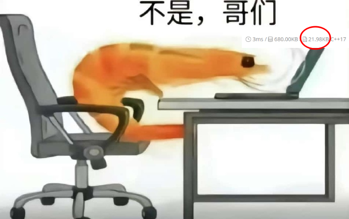

# 杂记：一道洛谷的题目

!!! abstract "导言"

    遇到一道洛谷的题目不会做，通过搜索引擎投机取巧了一下，发现题目很简单，是我太菜，因此记录一下。此外，还有一些有趣的发现，更值得记录一下。

!!! info "题目"

    ## **U207568：聪明的 Ether**

    Ether 是一个非常喜欢数学的同学，有一天 Ether 的同学带来了n块面值不同的纪念币，Ether 的同学非常热情，可是由于当时只有 Ether 一个人在教室，所以他决定与 Ether 平分他带来的纪念币（**只能以个的单位分，即不能将每个纪念币拆开分**）。可是 Ether 的同学对数学并不感兴趣，他喜欢的是编程，所以他只会用 2 进制来计数，但他并不懂得进位。于是他决定改变分纪念币的方式，他想让他和 Ether 最后分得的纪念币数量在** 2 进制位**上相等，例如Ether分得 3 元、 2 元。2 个纪念币在 Ether 同学看来对应的 2 进制位是 01（因为他并不知道 11 + 10 的进位所以计算得 01），而 Ether 的同学分得 1 元，对应的 2 进制位是 1，所以 Ether 的同学非常同意这种分纪念币的方法，开心的与 Ether 分完了纪念币，**如果在 2 进制位上无法相等他就会不开心。**

    现在请你编写一个程序帮助 Ether，在使 Ether 的同学开心的情况下使得 Ether 能拿到价值总和更大的纪念币！

??? note "题目细节"

    ### 输入格式

    第一行输入一个正整数**n**,接下来的一行输入**n**个**正整数**代表每个纪念币的面值。

    ### 输出格式

    如果能够满足要求则在第一行输出“YES”,并在第二行输出Ether能分的纪念币的**最大面值总和**。如果不能满足则输出“NO”。

    ### 样例 #1

    #### 样例输入 #1

    ```
    3
    1 2 3
    ```

    #### 样例输出 #1

    ```
    YES
    5
    ```

    ### 提示

    数据范围：
    **2<=n<=1000000**

    每个纪念币的面值:**0~1000000**

## Step 1. 还原题目

依据题目，Ether 和他同学在价值计算上存在差异，Ether 准备利用这一差异狠狠赚一笔。 ~~Ether 这人太坏了。~~ Ether 对价值的计算是币值的和，Ether 同学对价值的计算是 “无进位的二进制加法”，也就是异或运算。因此问题可以转述为:

```mardkdown title="题目"
给定一个长度为 n 的数组，将其分为两个子数组 A 和 B，使得 A 的异或和等于 B 的异或和,
并使得 A 的和最大。如果存在这样的分法，输出 YES，并输出 A 的和，否则，输出 NO。
```

## Step 2. 搜索命题点

想不出来怎么做，开始投机取巧。从还原出的题目中可以看到出题人是围绕则“异或”来出题的，因此在一顿搜索下，发现了[参考资料](https://www.zhihu.com/question/535544800)。核心是一个结论：A 和 B 的异或和相等当且仅当所有数的异或和为0，因此此时最大部分和就是除去最小的那个元素后的所有数的和。

## Step 3. 完成问题

继续投机取巧，把思路扔给 ai，开摆。以下回答来自 AI：

思路补全：

1. 首先，我们需要计算整个数组的异或和。如果异或和不为0，那么不可能将数组分为两个异或和相等的子数组，直接输出“NO”。
2. 如果异或和为0，那么我们可以将数组分为两个异或和相等的子数组。为了使A的和最大，我们应该将除了最小的那个元素之外的所有元素放入A中。
3. 计算除了最小元素之外的所有元素的和，即为A的最大和。
4. 输出“YES”和A的最大和。
   下面是按照这个思路编写的代码：

??? tip "C 语言"

    ```c
    #include <stdio.h>
    int main() {
        int n;
        scanf("%d", &n);
        int arr[1000000];
        int xor_sum = 0, min_val = 1000001, sum = 0;
        for (int i = 0; i < n; ++i) {
            scanf("%d", &arr[i]);
            xor_sum ^= arr[i];
            sum += arr[i];
            if (arr[i] < min_val) {
                min_val = arr[i];
            }
        }
        if (xor_sum == 0) {
            printf("YES\n%d\n", sum - min_val);
        } else {
            printf("NO\n");
        }
        return 0;
    }
    ```

??? tip "C++"

    ```cpp
    #include <iostream>
    #include <vector>
    #include <algorithm>
    int main() {
        int n;
        std::cin >> n;
        std::vector<int> arr(n);
        int xor_sum = 0, min_val = 1000001, sum = 0;
        for (int i = 0; i < n; ++i) {
            std::cin >> arr[i];
            xor_sum ^= arr[i];
            sum += arr[i];
            min_val = std::min(min_val, arr[i]);
        }
        if (xor_sum == 0) {
            std::cout << "YES\n" << sum - min_val << std::endl;
        } else {
            std::cout << "NO" << std::endl;
        }
        return 0;
    }
    ```

??? tip "Python"

    ```python
    n = int(input())
    arr = list(map(int, input().split()))
    xor_sum = 0
    min_val = min(arr)
    sum_val = sum(arr)
    for num in arr:
        xor_sum ^= num
    if xor_sum == 0:
        print("YES")
        print(sum_val - min_val)
    else:
        print("NO")
    ```

??? tip "Java"

    ```java
    import java.util.Scanner;
    public class Main {
        public static void main(String[] args) {
            Scanner scanner = new Scanner(System.in);
            int n = scanner.nextInt();
            int[] arr = new int[n];
            int xor_sum = 0, min_val = 1000001, sum = 0;
            for (int i = 0; i < n; ++i) {
                arr[i] = scanner.nextInt();
                xor_sum ^= arr[i];
                sum += arr[i];
                min_val = Math.min(min_val, arr[i]);
            }
            if (xor_sum == 0) {
                System.out.println("YES");
                System.out.println(sum - min_val);
            } else {
                System.out.println("NO");
            }
        }
    }
    ```

??? tip "Go"

    ```go
    package main
    import (
     "bufio"
     "fmt"
     "os"
     "strconv"
     "strings"
    )
    func main() {
     reader := bufio.NewReader(os.Stdin)
     fmt.Fscanln(reader, &n)
     arr := make([]int, n)
     xor_sum, min_val, sum := 0, 1000001, 0
     for i := 0; i < n; i++ {
      fmt.Fscan(reader, &arr[i])
      xor_sum ^= arr[i]
      sum += arr[i]
      if arr[i] < min_val {
       min_val = arr[i]
      }
     }
     if xor_sum == 0 {
      fmt.Println("YES")
      fmt.Println(sum - min_val)
     } else {
      fmt.Println("NO")
     }
    }
    ```

## Step 4. 见证作者的恶意

~~事实证明 Ether 确实是一个坏比。~~ 作者于 2022/05/19 日 10:05 修改了测试样例，我依据提交后的提示偷了部分结果 `HelloKKKK234HelloK1234523KKKKcde50123abc123abcbc123abcbcKKK123abcbcKKK` 没看出明显的规律，推测作者随机生成了一个长字符串作为结果。此外，可以看到作者最后一次提交的代码文件大小为 21.98 KB。所以，Man, what can I say?

{style: width=80% height=auto}
