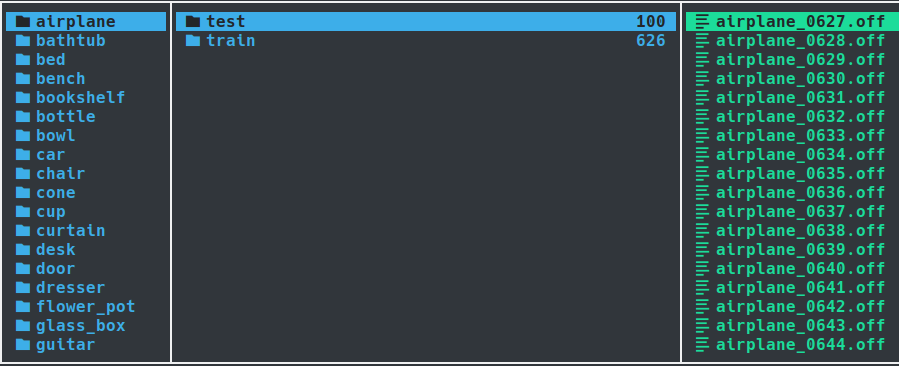

# 关于 ModelNet40 数据集

!!! Abstract "导言"

    ModelNet40 是三维对抗攻防中一个非常常用的数据集，绝大多数方法都会在该数据集上进行评估。然而，在阅读相关论文时，会发现这个数据集有很多变体，通常是前人工作中预处理过后的版本，这导致论文（代码）中提到 ModelNet40 数据集时往往带有多意性。另一方面，最近尝试复现的点云对抗防御方法 **IF-Defense** ，需要在 ModelNet40 的基础上构建一个变体数据集，但在运行作者的脚本时遇到问题，需要梳理一下它的构建细节，因此，在这里对 ModelNet40 的各种变体和构建细节进行记录。本文将忽略数据集的存储细节也不会包括如何实现 DataSet 类来读取数据的内容。

## Root: ModelNet

ModelNet 的[官网](https://modelnet.cs.princeton.edu/) 包含两个版本：ModelNet10 和 ModelNet40。每个数据是代表一个 CAD 模型，以对象文件格式(OFF, Object File Format) 存储，其中 ModelNet10 是手动对齐过的。后来 Orientation-boosted Voxel Nets for 3D Object Recognition 的作者提供了 ModelNet40 的对齐版本。数据集组织方式如下图所示：

{style: width=100% height=auto}

??? tip "构建细节"

    注：在 ai 对论文的总结上修改而来。

    1. **数据收集**：从 3D Warehouse 和 Yobi3D 搜索引擎（索引了 261 个 CAD 模型网站）下载 3D CAD 模型。

    2. **类别选择**：基于 SUN 数据库中的常见对象类别进行查询，选择每个类别至少包含 20 个实例的类别，排除了搜索结果太少的类别。

    3. **数据清洗**：

        1. **移除误分类模型**：由 Amazon Mechanical Turk 上的工作人员确认类别标签是否与模型匹配以识别和去除错误分类的模型。

        2. **移除无关对象**：作者手动检查每个3D模型，从每个CAD模型中移除不相关对象（例如，地板、缩略图、站在物体旁边的人物等），确保每个网格模型只包含属于标注类别的一个对象。

        3. **移除不现实的模型**：包括过于简化的模型或仅包含对象图片的模型。

        4. **移除重复模型**：确保数据集中的模型不重复。

## Version 1: ModelNet40 Hdf5

该版本来自于

??? tip "构建细节"

    注：在 ai 对论文的总结上修改而来。

    1. **数据集划分**：将数据集分为训练集（9,843 个模型）和测试集（2,468 个模型）。

    2. **数据预处理**：

        1. **数据采样**：从每个 3D 模型的网格面上均匀采样 1024 个点，采样基于网格面积进行。

        2. **数据归一化**：将采样的点云归一化到单位球内。

## Version 2: ModelNet40 Resampled

## Version 3: ModelNet10 250 Sample

## Version 4：ModelNet40 with Watertight Mesh

该版本来自于三维对抗的一项防御方法 `IF-Defense`（[github 链接](https://github.com/Wuziyi616/IF-Defense/tree/main)），作者需要训练一个能将点云转化为网格的网络，该网络来自于 `Occupancy Network`（[github 链接](https://github.com/autonomousvision/occupancy_networks)）, 训练时的监督信号是：空间的中的某一点在模型的内部还是外部（参考 [占据网格](../00_read_paper/3D_Reconstruction/occupancy_network.md)），因此需要保证训练使用的曲面是封闭的也即水密网格，故作者在原始的 ModelNet40 的基础上使用 `Manifold` （[github 链接](https://github.com/hjwdzh/Manifold)）来将网格转化为水密网格。

### 构建细节

#### 问题：不完整的构建过程

作者提供了他创建数据集过程中使用的脚本，但这些脚本只存在硬编码路径、无法直接组合使用的问题，见 `IF-Defense/ONet/data_proc/build.sh` 第 47 行：

```bash linenums="47" hl_lines="3" title="build.sh"
# mave meshes processed by Manifold to current folder
echo "Move watertight meshes to in_folder"
cp /home/wzw/WZY/SUMMER/Manifold/data/MN40_watertight/$c/*.off $build_path_c/2_watertight
```

需要先创建水密网格，而在 `IF-Defense/ONet/data_proc/make_watertight.py` 第 46 行：

```python linenums="45" hl_lines="2" title="make_watertight.py"
for one_class in all_class:
    class_root = os.path.join(data_root, one_class, '0_in')
    all_file = os.listdir(class_root)
    all_file.sort()
```

这里对 `data_root` 中每个类别文件夹下的 `0_in` 进行操作，而不考虑手工创建时，这个文件夹会在 `build.sh` 的第 11 行创建：

```bash linenums="11" hl_lines="1" title="build.sh"
mkdir -p $build_path_c/0_in \
          $build_path_c/1_scaled \
          $build_path_c/1_transform \
          $build_path_c/2_depth \
          $build_path_c/2_watertight \
          $build_path_c/4_points \
          $build_path_c/4_pointcloud \
          $build_path_c/4_watertight_scaled \
```

所以，在没有人工介入时，及时调整好路径设置也会面临 `build.sh` 和 `make_watertight.py` 循环依赖的问题，此外，`build.sh` 中也没有给出 `0_in` 文件夹下文件的创建过程。

#### 溯源：Occupancy Networks 的数据集构建过程(TODO)

全混在一起，然后切了三份
