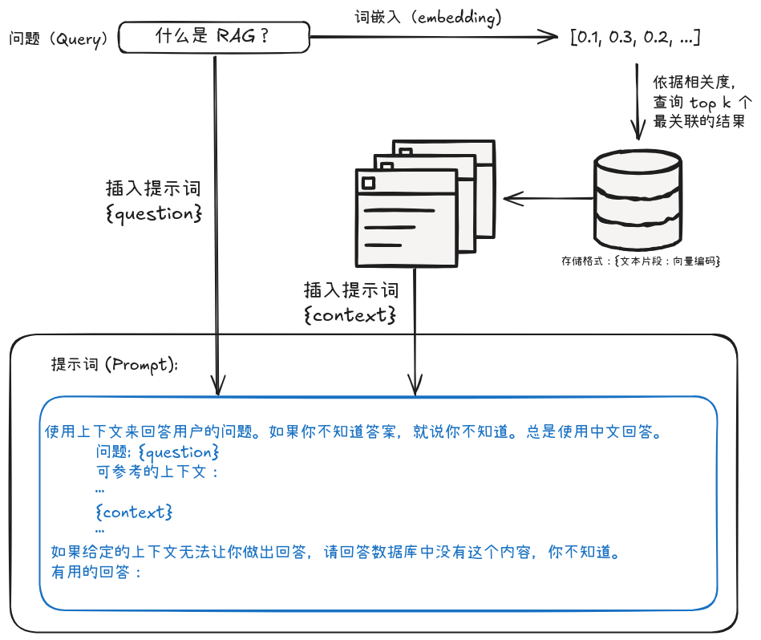

# LLM 学习：Day1 - RAG

!!! abstract "导言"

    回顾一年，感觉已经开始落后时代。一直在做科研，但所研究方向和主流渐行渐远；一直在尝试使用 ai 工具提高效率，但总是对其背后的技术仍是一知半解。一年过去，惊觉自己已经错过了太多。为了避免脱离时代，新的一年就以学习当前 LLM 的相关技术开始吧。

    Day1 计划：在服务器上部署一个简单的 RAG 服务，其知识库内容为本篇以及后续的学习笔记，方便之后回顾。
    Day2 计划：学习 Milvus，将其作为部署的 RAG 的数据库 & 优化接口
    Day3 计划：了解 LangChain, Coze 等框架/平台
    Day4 计划：在服务器上部署一个简单的 Agent 服务

??? notes "RAG"

    RAG（Retrieval-Augmented Generation，检索增强生成）是一种通过结合检索技术来提升大语言模型（LLM）回答质量的技术框架。其在 Facebook 在 2020 年发表的论文[《Retrieval-Augmented Generation for Knowledge-Intensive NLP Tasks》](https://arxiv.org/pdf/2005.11401v4) 中被提出，应用于知识敏感的 NLP 任务，如知识问答。

    RAG 将问题求解划分为检索和生成两阶段，先通过检索，查找与问题相关的文档，再将文档和问题一并输入模型，由模型推理给出最终的答案，从而解决模型无法扩展知识和产生“幻觉”的问题。

<!-- more -->

## 为什么需要 RAG？
LLM 的回答主要依赖于两类知识：首先是**参数化知识**，即模型通过训练学习到的、存储在参数中的知识，这些知识主要来源于训练时使用的海量网络数据；其次是**非参数化知识**，即上下文中的信息，包括当前对话的提示词和历史内容，这部分完全依赖于用户输入。然而，当问题涉及特定领域或本地化知识时，LLM 的上下文窗口往往显得捉襟见肘，容易导致模型产生“幻觉”现象。RAG 技术通过引入检索机制，能够更高效地利用上下文窗口，让 LLM 的回答更加准确和定制化，从而有效缓解这一问题。

## RAG 原理
论文中使用了很多符号，但要理解 RAG 的原理并不需要如此复杂，参考下图:

## RAG 实现

2核2G 的服务器配置显然无法满足本地运行大模型的需求，甚至难以在本地进行词嵌入处理。经过权衡，最终决定采用如下方案：调用智谱 AI 的 API 进行词嵌入处理，然后使用近期备受关注的 DeepSeek 做为对话模型（主要是注册送的免费 token 多）。

