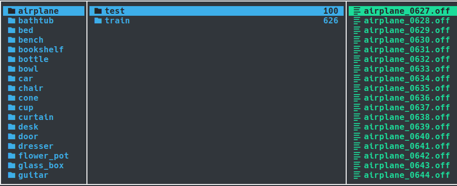
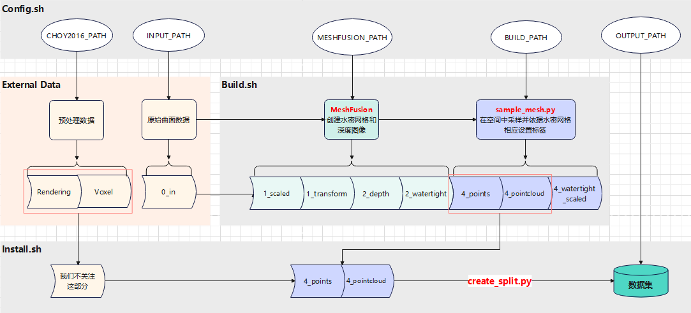
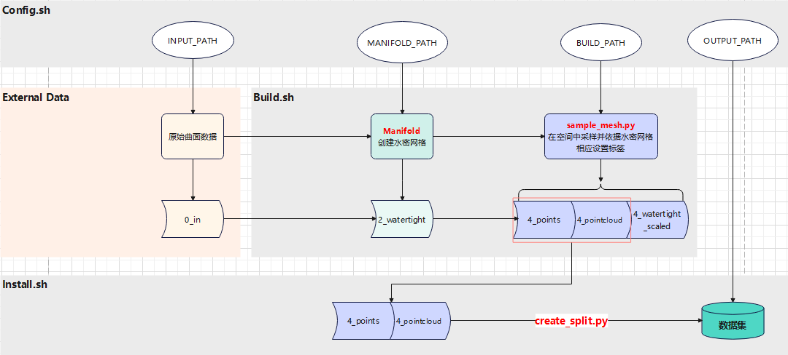

# 关于 ModelNet40 数据集

!!! Abstract "导言"

    ModelNet40 是三维对抗攻防中一个非常常用的数据集，绝大多数方法都会在该数据集上进行评估。然而，在阅读相关论文时，会发现这个数据集有很多变体，通常是前人工作中预处理过后的版本，这导致论文（代码）中提到 ModelNet40 数据集时往往带有多意性。另一方面，最近尝试复现的点云对抗防御方法 **IF-Defense** ，需要在 ModelNet40 的基础上构建一个变体数据集，但在运行作者的脚本时遇到问题，需要梳理一下它的构建细节。因此，在这里对 ModelNet40 的各种变体和构建细节进行记录。本文将忽略数据集的存储细节也不会包括如何实现 DataSet 类来读取数据的内容。

<!-- more -->

## Root: ModelNet

ModelNet 的[官网](https://modelnet.cs.princeton.edu/) 包含两个版本：ModelNet10 和 ModelNet40。每个数据是代表一个 CAD 模型，以对象文件格式(OFF, Object File Format) 存储，其中 ModelNet10 是手动对齐过的。后来 Orientation-boosted Voxel Nets for 3D Object Recognition 的作者提供了 ModelNet40 的对齐版本。数据集组织方式如下图所示：

{style: width=100% height=auto}

??? tip "构建细节"

    注：在 ai 对论文的总结上修改而来。


    1. **数据收集**：从 3D Warehouse 和 Yobi3D 搜索引擎（索引了 261 个 CAD 模型网站）下载 3D CAD 模型。


    2. **类别选择**：基于 SUN 数据库中的常见对象类别进行查询，选择每个类别至少包含 20 个实例的类别，排除了搜索结果太少的类别。


    3. **数据清洗**：


        1. **移除误分类模型**：由 Amazon Mechanical Turk 上的工作人员确认类别标签是否与模型匹配以识别和去除错误分类的模型。


        2. **移除无关对象**：作者手动检查每个3D模型，从每个CAD模型中移除不相关对象（例如，地板、缩略图、站在物体旁边的人物等），确保每个网格模型只包含属于标注类别的一个对象。


        3. **移除不现实的模型**：包括过于简化的模型或仅包含对象图片的模型。


        4. **移除重复模型**：确保数据集中的模型不重复。

## Version 1: ModelNet40 Hdf5

该版本来自于

??? tip "构建细节"

    注：在 ai 对论文的总结上修改而来。


    1. **数据集划分**：将数据集分为训练集（9,843 个模型）和测试集（2,468 个模型）。


    2. **数据预处理**：


        1. **数据采样**：从每个 3D 模型的网格面上均匀采样 1024 个点，采样基于网格面积进行。


        2. **数据归一化**：将采样的点云归一化到单位球内。

## Version 2: ModelNet40 Resampled

## Version 3: ModelNet10 250 Sample

## Version 4：ModelNet40 for Onet

该版本来自于三维对抗的一项防御方法 `IF-Defense`（[github 链接](https://github.com/Wuziyi616/IF-Defense/tree/main)），作者需要训练一个能将点云转化为网格的网络，该网络来自于 `Occupancy Network`（[github 链接](https://github.com/autonomousvision/occupancy_networks)）, 训练时的监督信号是：空间的中的某一点在模型的内部还是外部（参考 [占据网格](../00_read_paper/3D_Reconstruction/occupancy_network.md)），因此需要保证训练使用的曲面是封闭的也即水密网格。 `IF-Defense` 的作者参考了这个 [issue](https://github.com/autonomousvision/occupancy_networks/issues/27) 使用 `Manifold` （[github 链接](https://github.com/hjwdzh/Manifold)）来将网格转化为水密网格，从而规避了一些额外的预处理步骤。

### 构建细节

#### 问题：不完整的构建过程

作者提供了他创建数据集过程中使用的脚本，但这些脚本只存在硬编码路径、无法直接组合使用的问题，见 `IF-Defense/ONet/data_proc/build.sh` 第 47 行：

```bash linenums="47" hl_lines="3" title="build.sh"
# mave meshes processed by Manifold to current folder
echo "Move watertight meshes to in_folder"
cp /home/wzw/WZY/SUMMER/Manifold/data/MN40_watertight/$c/*.off $build_path_c/2_watertight
```

需要先创建水密网格，而在 `IF-Defense/ONet/data_proc/make_watertight.py` 第 46 行：

```python linenums="45" hl_lines="2" title="make_watertight.py"
for one_class in all_class:
    class_root = os.path.join(data_root, one_class, '0_in')
    all_file = os.listdir(class_root)
    all_file.sort()
```

这里对 `data_root` 中每个类别文件夹下的 `0_in` 进行操作，而不考虑手工创建时，这个文件夹会在 `build.sh` 的第 11 行创建：

```bash linenums="11" hl_lines="1" title="build.sh"
mkdir -p $build_path_c/0_in \
         $build_path_c/1_scaled \
         $build_path_c/1_transform \
         $build_path_c/2_depth \
         $build_path_c/2_watertight \
         $build_path_c/4_points \
         $build_path_c/4_pointcloud \
         $build_path_c/4_watertight_scaled \
```

所以，在没有人工介入时，即使调整好路径设置也会面临 `build.sh` 和 `make_watertight.py` 循环依赖的问题，此外，`build.sh` 中也没有给出 `0_in` 文件夹下文件的创建过程。

#### 溯源：Occupancy Networks 的数据集构建过程

作者的脚本是在从`Occupancy Networks` 的脚本（见 `occupancy_networks/scripts`) 修改而来的，原脚本处理的是 `ShapeNet` 数据集，构建流程如下图所示：



核心是三个 bash 脚本，`config.sh` 用于设置全局变量，主要是指定路径、类别名称、线程数等；`build.sh` 负责将网格数据转化为水密网格；`intsall.sh` 负责最终组装数据集并对数据进行切分。`0_in` 中的数据是原数据集的 `.off` 文件，按类别分到不同文件夹下。我推测这里是使用了整个数据集的模型，因为最后创建数据集时是从所有数据中划分测试集，而不是沿用原数据集的测试集。

上图中 `CHOY2016_PATH` 用于指定 3D-R2N2 (Choy et al. 2016, [arixv 链接](https://arxiv.org/abs/1604.00449), [github 链接](https://github.com/chrischoy/3D-R2N2)) 预处理的数据集的路径，对于我们目标的任务场景而言，并不需要这部分信息，因此可以移除。另一方面，我们不需要深度图像信息，而创建水密网格的部分可以用 `Manifold` 替代，进一步规避了一些额外的预处理步骤。简化后的流程图如下：



#### 重整：一个完整的构建过程

三个核心脚本的运行依赖于 Manifold 和几个 python 文件，后者除了依赖第三方包还依赖于 Occupancy Networks 作者写的 `im2mesh` 包，需要运行 `setup.py` 脚本安装。此外，还需要下载相应数据集并在 `config.sh` 中进行正确的配置。

配置完成后，先进行水密曲面的生成，然后在和原来一样依次运行 `build.sh` 和 `install.sh` 脚本，也可以将生成部分合并到 `build.sh` 中，反正按流程来就行。水密曲面的生成在 IF-Defense 作者提供的 `make_watertight.py` 脚本上稍微改改就行，不做赘述。

??? tip "安装 im2mesh"

    简单来说，整个安装过程就是两步：

    ``` bash
    python setup.py build_ext --inplace
    python install
    ```

    这两行命令起到的效果就是依次编译 `im2mesh.utils` 下的 lib* 文件并构建相应模块，`--inplace` 指定动态链接库放在 lib* 所在的文件夹下，之后可以使用 python 调用相关接口。需要注意的是，`sample_mesh.py` 中使用的 `libmesh` 没有出现在 IF-Defense 作者提供的 `im2mesh` 中，可能作者使用其他方法替代了 `check_mesh_contains` 函数（我对这个不太了解），因此这里需要从原仓库中借过来这部分代码（`setup.py` 也要补充）。

??? tip "how to do better"

    这里讨论一下 `sample_mesh.py` 中的第 9 行的 **TODO** 怎么进行。按原来的 `setup.py` 脚本安装的话， `libmesh` 中其实并不包含 `check_mesh_contains` 函数，只有编译构建的模块 `triangle_hash`，或者说 `check_mesh_contains` 函数没有被 "安装"。作者的解决方案是硬编码包搜索路径，拓展 `PYTHONPATH` 从而可以找到这个函数。这个方案的问题是 `sample_mesh.py` 和 `im2mesh` 的相对位置被硬编码，产生了不必要的耦合。

    解决方法是简单的，问题产生的原因是 `setup.py` 中只指明了 `libmesh.triangle_hash` 是一个模块，而没有指明 `libmesh` 是一个包，因此只需要在 `setup.py` 的 `setup` 函数中增加一行 `packages=find_packages()` 让程序发现 `libmesh` 是一个包再重新安装就可以了。
