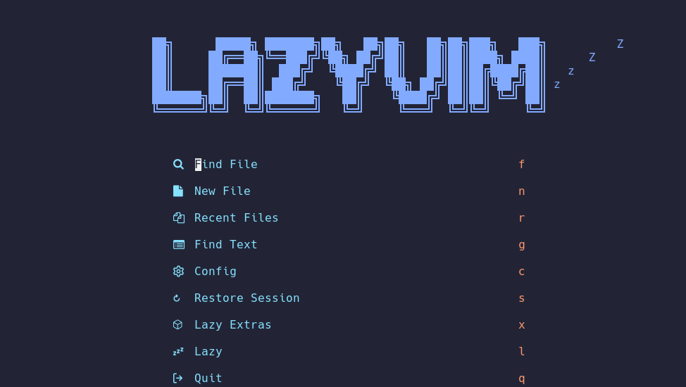

!!! abstract "导言"

    当我们得到了一个新的服务器账号，常常需要进行一些简单的配置以符合个人的使用习惯，促进后续的工作的开展。但是每得到一个新的账号就进行一次这样的初始化实在太过低效，尤其是很多安装命令需要再次查找甚至需要重新理解，因此，建立这个文档，之后将常用的初始化安装汇集在此。

    注：在概念上这里记录的内容和 `homebrew`、`just` 等工具中的 "配方" 是相近的，或许后续可以考虑引入类似的工具来自动化安装？

<!-- more -->

!!! info

    只记录完成某个目的所使用的命令以及一些简单的信息，实践中目的完成顺序并不一定按记录顺序来。

## 一、安装 Miniconda

### 1. 下载 Miniconda 安装脚本

这里下载发布的最新版本

```bash
wget https://repo.anaconda.com/miniconda/Miniconda3-latest-Linux-x86_64.sh
```

### 2. 使用脚本安装 Miniconda

按照脚本的指示进行安装即可

```bash
sh Miniconda3-latest-Linux-x86_64.sh
```

## 二、安装无 root 下 apt 能安装的程序

这种安装的基本流程是使用 `apt download` 来下载对应的 .deb 包，然后使用 `dpkg -x` 来将包安装到指定的位置。这种安装方式需要自己处理依赖，还需要面对一些不安装在默认位置就会出问题的情况。

注：下载得到的 .deb 包版本可能有差异，下面的命令仅供参考。

```bash title="安装 neofetch"
apt download neofetch
dpkg -x neofetch_7.0.0-1_all.deb ~/.local/
```

```bash title="安装 Lua5.2"
apt download lua5.2
dpkg -x lua5.2_5.2.4-1.1build3_amd64.deb ~/.local/
```

这样安装需要自己创建 lua 的符号链接

```bash
ln -s ~/.local/usr/bin/lua5.2 ~/.local/usr/bin/lua
```

```bash title="安装 fd-find"
apt download fd-find
dpkg -x fd-find_7.4.0-2ubuntu0.1_amd64.deb ~/.local/
```

## 三、安装 johsuto

??? info "about joshuto"

    TODO

这里采用 cargo 来进行 joshuto 的安装。

### 1. 使用 rustup 安装 rust 工具链（包括 cargo）

注：访问 [官方网页](https://www.rust-lang.org/tools/install) 获得最新的安装命令，下面的命令仅供参考。

```bash
curl --proto '=https' --tlsv1.2 -sSf https://sh.rustup.rs | sh
```

### 2. 使用 cargo 安装 joshuto

```bash
cargo install --git https://github.com/kamiyaa/joshuto.git --force
```

### 3. 一些简单的配置

!!! info "参考资料"

    TODO

## 四、安装 nvim + lazyvim

### 1. 安装 Nerd Font 字体

到 [这个网页](https://www.nerdfonts.com/font-downloads) 中挑选喜欢的字体，然后复制它的压缩包下载链接

```bash title="下载 JetBrainsMono"
wget https://github.com/ryanoasis/nerd-fonts/releases/download/v3.2.1/JetBrainsMono.zip
```

解压字体文件到合适的位置

```bash
unzip JetBrainsMono.zip -d ~/.local/share/fonts
```

可能需要先创建一下这个文件夹

```bash
mkdir -p ~/.local/share/fonts
```

使用 `fc-cache` 命令安装字体文件

```bash
fc-cache -fv
```

输出中应该包含如下所示的一行：


### 2. 安装 python3 环境（需要 root)

```bash
sudo apt install python3 python3-venv python3-pip
```

### 3. 安装 NPM

#### 3.1 安装 NVM (Node Version Manager)

注：访问 [这个仓库](https://github.com/nvm-sh/nvm) 获得最新的安装命令，下面的命令仅供参考。

```bash
curl -o- https://raw.githubusercontent.com/nvm-sh/nvm/v0.40.1/install.sh | bash
```

#### 3.2 使用 NVM 安装合适的 node

先检查能安装什么版本

```bash
nvm ls-remote
```

这里安装 v20 的 LTS 版本

```bash
nvm install 20
```

### 4. 安装 Neovim

注：访问 [官方仓库](https://github.com/neovim/neovim) 获得最新的发布版本，下面的命令仅供参考。

为了使用一些新的特性，这里需要安装最新版本，因此使用 Releases 中的预构建版本。

```bash
wget https://github.com/neovim/neovim/releases/download/v0.10.1/nvim-linux64.tar.gz
tar zxf nvim-linux64.tar.gz
```

把解压文件存放在一个合适的位置，然后在 `$PATH` 包含的路径中建立一个符号链接来指向 nvim

```bash
mv nvim-linux64 ~/.local/usr/
ln -s ~/.local/usr/nvim-linux64/bin/nvim ~/.local/usr/bin/nvim
```

### 5. 安装 LazyVim

下载 `LazyVim/starter` 将其做为 `nvim` 的配置即可，之后打开 `nvim` 会自动初始化一切

```bash
git clone https://github.com/LazyVim/starter ~/.config/nvim
nvim
```

### 6. 一些简单的配置



!!! info "参考资料"

    - [bilibili: Neovim从新手到高手系列之轻松安装LazyVim](https://www.bilibili.com/video/BV1uE421u7xE)

## 五、安装 z.lua

??? info "about z.lua"

    TODO

该程序使用 lua 编写，需要先安装 lua，如果没有 root 权限也可以参考无 root 安装 lua 一节进行安装。另一方面，该程序是自包含的，因此只需要将 z.lua 文件存放到一个合适的位置并在初始化时指定即可。

```bash title="下载 z.lua"
git clone https://github.com/skywind3000/z.lua.git
mv z.lua/z.lua ~/.local/usr/
```

在 .bashrc 中配置 z.lua 的初始化命令并开启增强模式和 fzf 支持。个人使用习惯上偏好双字母的命令，因此设置其名称为 `zz`。其他配置见 [这个文档](https://github.com/skywind3000/z.lua/blob/master/README.cn.md)。

```bash title=".bashrc"
export _ZL_MATCH_MODE=1
export _ZL_CMD='zz'
eval "$(lua ~/.local/usr/z.lua  --init bash enhanced fzf)"
```

## 六、安装 cargo 能安装的程序

??? info "about ripgrep"

```bash title="安装 ripgrep"
cargo install ripgrep
```

??? info "about mcfly"

```bash title="安装 mcfly"
cargo install mcfly
```

??? info "about lsd"

```bash title="安装 lsd"
cargo install lsd
```

使用前需要初始化，在 .bashrc 中添加如下命令即可

```bash title=".bashrc"
  TODO
```

??? info "about bat"

```bash title="安装 bat"
cargo install bat
```

??? info "about zellij"

```bash title="安装 zellij"
cargo install zellij
```

## 七、安装 fzf

```bash
wget https://github.com/junegunn/fzf/releases/download/v0.55.0/fzf-0.55.0-linux_amd64.tar.gz
tar zxf nvim-linux64.tar.gz
mv fzf ~/.local/usr/bin/
```

## 八、设置别名

```shell title=".bashrc"
alias lgit="lazygit"
alias jo="joshuto"
alias ls='lsd'
alias ll='lsd -alF'
alias la='lsd -A'
alias l='lsd -CF'
```

## 九、安装 lazygit

先获取最新的版本号，再根据版本号下载发布的最新压缩包，解压后安装即可。

```bash
LAZYGIT_VERSION=$(curl -s "https://api.github.com/repos/jesseduffield/lazygit/releases/latest" | grep -Po '"tag_name": "v\K[^"]*')
curl -Lo lazygit.tar.gz "https://github.com/jesseduffield/lazygit/releases/latest/download/lazygit_${LAZYGIT_VERSION}_Linux_x86_64.tar.gz"
tar xf lazygit.tar.gz lazygit
install lazygit ~/.local/usr/bin
```

!!! info "参考资料"

    - [官方仓库的 install 一节](https://github.com/jesseduffield/lazygit?tab=readme-ov-file#ubuntu)
