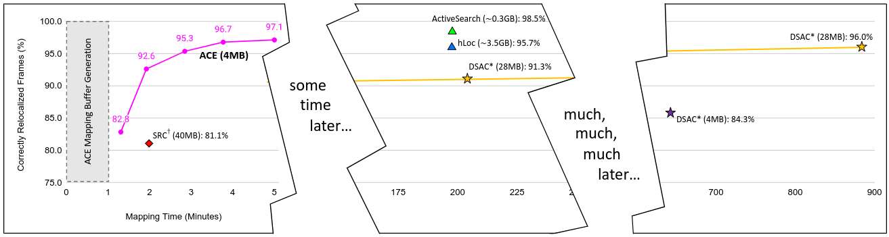

!!! abstract "导言"

    最近两天连着遇到了两次服务器故障问题，第一次在实验室修了一个下午，手脚冰冷；第二次在机房里修了一个晚上，头皮发麻。万幸的是两次故障都成功解决，因此算是一段比较有趣的经历，记录之。

<!-- more -->

??? info "参考方案"

    - [NVIDIA版本与NVML版本冲突解决方案](https://zhuanlan.zhihu.com/p/685593441)

## 第一次故障

### 背景

出于某些原因，获得了工友服务器的 `root` 权限，在服务器上指点江山时，发现：

[!驱动与版本不配](./images/驱动与库版本不匹配.png)

## 第二次故障

### 背景
